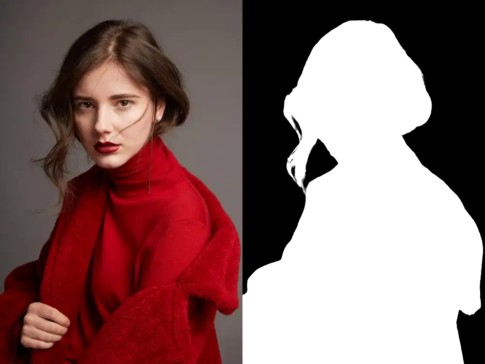

# MEDIANN FFmpeg
## 简介
项目实现了基于神经网络的AI图像/视频处理，包括但不限于去噪、修复、增强、超分等任务，项目的推理引擎使用onnxruntime+cuda+cudnn+tensorrt，媒体处理框架使用ffmpeg4.2.1，滤镜调用推理引擎进行图像/视频的处理。
- 各种类型的神经网络图像处理，包括单帧、多帧等AI处理。
- 支持cpu、cuda、tensorrt推理模式。
- 支持window下、linux（centos 7/ ubuntu 18.04）下推理。

## 版本下载

| 版本 | window | linux | models |
|:-------:|:-------:|:-------:|:-------:|
| v1.0.0 | [ffmpeg-win10](https://github.com/jlygit/MediaNN/releases/download/v1.0.0/ffmpeg-win10.zip)  | [ffmpeg-linux](https://github.com/jlygit/MediaNN/releases/download/v1.0.0/ffmpeg-linux.zip) | [models](https://github.com/jlygit/MediaNN/releases/download/v1.0.0/models.zip) |
| v1.0.1 | - | - | - |

## mediaNN 滤镜
支持单帧的任意倍数的视频/图片处理。
``` bash
./ffmpeg  -i ../../testsets/OnePiece.mp4  -vf "mediaNN=engine=cuda:gpu=0:threads=8:split_num=2:upscale=4:model=../../models/RealESRGAN/realesr-animevideov3_x4.onnx:config=../../models/RealESRGAN/config.json" -c:a copy -c:v libx264 -pix_fmt yuv420p -preset slow  -y testout.mp4
```
参数解释：
- engine，指定推理引擎是cuda或tensorrt或cpu，如果要启用tensorrt推理，请自行下载TensorRT-8.5.3对应的动态库放入到可执行文件的同级目录下。
- gpu，指定nvidia gpu卡的索引。
- threads，指定cpu推理时采用的线程数量。
- split_num，推理时的分片数量，对于很大的模型，请增加分片数量，以免内存或显存不足。
- upscale，指定超分的倍数，可以是1、2、3、4等，根据模型指定。
- model，指定onnx模型的路径。
- config，指定模型的输入和输出配置，可以参考models路径下的config.json示例。

### 支持优秀的超分或同分修复增强的模型
- [Real-ESRGAN](#Real-ESRGAN)
- [RFDN](#RFDN)
- [Real CUGAN](#Real-CUGAN)
- [SwinIR](#SwinIR)
- [HAT](#HAT)

<p align="center">
  
</p>

### [Real-ESRGAN](https://github.com/xinntao/Real-ESRGAN)
``` bash
# X4 model for general 
./ffmpeg  -i ../../testsets/Set5/LRbicx4/woman.png  -vf "mediaNN=engine=cuda:gpu=0:threads=8:split_num=10:upscale=4:model=../../models/RealESRGAN/RealESRGAN_x4plus.onnx:config=../../models/RealESRGAN/config.json" -y  ../../outdirs/woman_REALESRGAN_x4.png

# X4 model with MSE loss (over-smooth effects)
./ffmpeg  -i ../../testsets/Set5/LRbicx4/woman.png  -vf "mediaNN=engine=cuda:gpu=0:threads=8:split_num=10:upscale=4:model=../../models/RealESRGAN/RealESRNet_x4plus.onnx:config=../../models/RealESRGAN/config.json" -y  ../../outdirs/woman_REALESRGAN_x4.png

# Optimized for anime images; 6 RRDB blocks 
./ffmpeg  -i ../../testsets/OnePiece.mp4  -vf "mediaNN=engine=cuda:gpu=0:threads=8:split_num=4:upscale=4:model=../../models/RealESRGAN/RealESRGAN_x4plus_anime_6B.onnx:config=../../models/RealESRGAN/config.json" -c:a copy -c:v libx264 -pix_fmt yuv420p -preset slow  -y ../../outdirs/testout.mp4

# Anime video model with XS size
./ffmpeg  -i ../../testsets/OnePiece.mp4  -vf "mediaNN=engine=cuda:gpu=0:threads=8:split_num=2:upscale=4:model=../../models/RealESRGAN/realesr-animevideov3_x4.onnx:config=../../models/RealESRGAN/config.json" -c:a copy -c:v libx264 -pix_fmt yuv420p -preset slow  -y ../../outdirs/testout.mp4

# X2 model for general 
./ffmpeg  -i ../../testsets/Set5/LRbicx2/woman.png  -vf "mediaNN=engine=cuda:gpu=0:threads=8:split_num=10:upscale=2:model=../../models/RealESRGAN/RealESRGAN_x2plus.onnx:config=../../models/RealESRGAN/config.json" -y  ../../outdirs/woman_REALESRGAN_x2.png

```
### [RFDN](https://github.com/njulj/RFDN)

``` bash
# for x4 model
 ./ffmpeg  -i ../../testsets/Set5/LRbicx4/woman.png  -vf "mediaNN=engine=cuda:gpu=0:threads=8:split_num=1:upscale=4:model=../../models/RFDN_x4/RFDN_x4.onnx:config=../../models/RFDN_x4/config.json" -y ./ffmpeg  -i ../../testsets/Set5/LRbicx4/woman.png  -vf "mediaNN=engine=cuda:gpu=0:threads=8:split_num=10:upscale=4:model=../../models/RealESRGAN/RealESRGAN_x4plus.onnx:config=../../models/RealESRGAN/config.json" -y  ../../outdirs/woman_REALESRGAN_x4.pngwoman_RFDN_x4.png
```

### [Real CUGAN](https://github.com/bilibili/ailab/tree/main/Real-CUGAN)
``` bash
# for up2x-latest-conservative
 ./ffmpeg  -i ../../testsets/anime.jpg  -vf "mediaNN=engine=cuda:gpu=0:threads=8:split_num=2:upscale=2:model=../../models/RealCUGAN/up2x-latest-conservative.onnx:config=../../models/RealCUGAN/config.json"  -y ../../outdirs/anime_x2.png

# for up2x-latest-denoise1x
 ./ffmpeg  -i ../../testsets/anime.jpg  -vf "mediaNN=engine=cuda:gpu=0:threads=8:split_num=2:upscale=2:model=../../models/RealCUGAN/up2x-latest-denoise1x.onnx:config=../../models/RealCUGAN/config.json"  -y ../../outdirs/anime_x2.png

 # for up2x-latest-denoise2x
./ffmpeg  -i ../../testsets/anime.jpg  -vf "mediaNN=engine=cuda:gpu=0:threads=8:split_num=2:upscale=2:model=../../models/RealCUGAN/up2x-latest-denoise2x.onnx:config=../../models/RealCUGAN/config.json"  -y ../../outdirs/anime_x2.png

 # for up2x-latest-denoise3x
./ffmpeg  -i ../../testsets/anime.jpg  -vf "mediaNN=engine=cuda:gpu=0:threads=8:split_num=2:upscale=2:model=../../models/RealCUGAN/up2x-latest-denoise3x.onnx:config=../../models/RealCUGAN/config.json"  -y ../../outdirs/anime_x2.png


# for up4x-latest-conservative
./ffmpeg  -i ../../testsets/anime.jpg  -vf "mediaNN=engine=cuda:gpu=0:threads=8:split_num=2:upscale=4:model=../../models/RealCUGAN/up4x-latest-conservative.onnx:config=../../models/RealCUGAN/config.json"  -y ../../outdirs/anime_x4.png

# for up4x-latest-denoise3x
./ffmpeg  -i ../../testsets/anime.jpg  -vf "mediaNN=engine=cuda:gpu=0:threads=8:split_num=2:upscale=4:model=../../models/RealCUGAN/up4x-latest-denoise3x.onnx:config=../../models/RealCUGAN/config.json"  -y ../../outdirs/anime_x4.png

# for up4x-latest-no-denoise
./ffmpeg  -i ../../testsets/anime.jpg  -vf "mediaNN=engine=cuda:gpu=0:threads=8:split_num=2:upscale=4:model=../../models/RealCUGAN/up4x-latest-no-denoise.onnx:config=../../models/RealCUGAN/config.json"  -y ../../outdirs/anime_x4.png

# for up3x-latest-no-denoise
./ffmpeg  -i ../../testsets/anime.jpg  -vf "mediaNN=engine=cuda:gpu=0:threads=8:split_num=2:upscale=3:model=../../models/RealCUGAN/up3x-latest-no-denoise.onnx:config=../../models/RealCUGAN/config.json"  -y ../../outdirs/anime_x3.png

# for up3x-latest-denoise3x
./ffmpeg  -i ../../testsets/anime.jpg  -vf "mediaNN=engine=cuda:gpu=0:threads=8:split_num=2:upscale=3:model=../../models/RealCUGAN/up3x-latest-denoise3x.onnx:config=../../models/RealCUGAN/config.json"  -y ../../outdirs/anime_x3.png

# for up3x-latest-conservative
./ffmpeg  -i ../../testsets/anime.jpg  -vf "mediaNN=engine=cuda:gpu=0:threads=8:split_num=2:upscale=3:model=../../models/RealCUGAN/up3x-latest-conservative.onnx:config=../../models/RealCUGAN/config.json"  -y ../../outdirs/anime_x3.png

```

### [waifu2x](https://github.com/nagadomi/nunif/)

``` bash

# for noise1_scale2x.onnx
`./ffmpeg  -i ../../testsets/anime.jpg  -vf "mediaNN=engine=cuda:gpu=0:threads=8:split_num=2:upscale=2:model=../../models/waifu2x/noise1_scale2x.onnx:config=../../models/waifu2x/config.json"  -y ../../outdirs/anime_x2.png`

# for noise1.onnx
./ffmpeg  -i ../../testsets/anime.jpg  -vf "mediaNN=engine=cuda:gpu=0:threads=8:split_num=2:upscale=1:model=../../models/waifu2x/noise1.onnx:config=../../models/waifu2x/config.json"  -y ../../outdirs/anime_x1.png

# 其他模型目录类似

```
### [SwinIR](https://github.com/JingyunLiang/SwinIR)
``` bash
#for 001_classicalSR_DF2K_s64w8_SwinIR-M_x2
./ffmpeg  -i ../../testsets/Set5/LRbicx4/woman.png  -vf "mediaNN=engine=cuda:gpu=0:threads=8:split_num=4:upscale=2:model=../../models/SwinIR/001_classicalSR_DF2K_s64w8_SwinIR-M_x2.onnx:config=../../models/SwinIR/config.json"  -y ../../outdirs/woman_swinir_x2.png

#for 001_classicalSR_DF2K_s64w8_SwinIR-M_x4
./ffmpeg  -i ../../testsets/Set5/LRbicx2/woman.png  -vf "mediaNN=engine=cuda:gpu=0:threads=8:split_num=4:upscale=4:model=../../models/SwinIR/001_classicalSR_DF2K_s64w8_SwinIR-M_x4.onnx:config=../../models/SwinIR/config.json"  -y ../../outdirs/woman_swinir_x4.png


#for 002_lightweightSR_DIV2K_s64w8_SwinIR-S_x2
./ffmpeg  -i ../../testsets/Set5/LRbicx2/woman.png  -vf "mediaNN=engine=cuda:gpu=0:threads=8:split_num=2:upscale=2:model=../../models/SwinIR/002_lightweightSR_DIV2K_s64w8_SwinIR-S_x2.onnx:config=../../models/SwinIR/config.json"  -y ../../outdirs/woman_swinir_x2.png

#for 002_lightweightSR_DIV2K_s64w8_SwinIR-S_x2
./ffmpeg  -i ../../testsets/Set5/LRbicx2/woman.png  -vf "mediaNN=engine=cuda:gpu=0:threads=8:split_num=4:upscale=2:model=../../models/SwinIR/003_realSR_BSRGAN_DFO_s64w8_SwinIR-M_x2_GAN.onnx:config=../../models/SwinIR/config.json"  -y ../../outdirs/woman_swinir_x2.png

#for 002_lightweightSR_DIV2K_s64w8_SwinIR-S_x4
./ffmpeg  -i ../../testsets/Set5/LRbicx4/woman.png  -vf "mediaNN=engine=cuda:gpu=0:threads=8:split_num=4:upscale=4:model=../../models/SwinIR/003_realSR_BSRGAN_DFO_s64w8_SwinIR-M_x4_GAN.onnx:config=../../models/SwinIR/config.json"  -y ../../outdirs/woman_swinir_x4.png

#for 003_realSR_BSRGAN_DFOWMFC_s64w8_SwinIR-L_x4_GAN
./ffmpeg  -i ../../testsets/Set5/LRbicx4/woman.png  -vf "mediaNN=engine=cuda:gpu=0:threads=8:split_num=6:upscale=4:model=../../models/SwinIR/003_realSR_BSRGAN_DFOWMFC_s64w8_SwinIR-L_x4_GAN.onnx:config=../../models/SwinIR/config.json"  -y ../../outdirs/woman_swinir_x4.png

# 其他模型目录类似

```

### [HAT](https://github.com/XPixelGroup/HAT)
``` bash
#for HAT_SRx2
./ffmpeg  -i ../../testsets/Set5/LRbicx2/woman.png  -vf "mediaNN=engine=cuda:gpu=0:threads=8:split_num=4:upscale=2:model=../../models/HAT/HAT_SRx2.onnx:config=../../models/SwinIR/config.json"  -y ../../outdirs/woman_hat_x2.png

#for HAT_SRx4
./ffmpeg  -i ../../testsets/Set5/LRbicx4/woman.png  -vf "mediaNN=engine=cuda:gpu=0:threads=8:split_num=4:upscale=4:model=../../models/HAT/HAT_SRx4.onnx:config=../../models/SwinIR/config.json"  -y ../../outdirs/woman_hat_x4.png

#for HAT-S_SRx2
./ffmpeg  -i ../../testsets/Set5/LRbicx2/woman.png  -vf "mediaNN=engine=cuda:gpu=0:threads=8:split_num=4:upscale=2:model=../../models/HAT/HAT-S_SRx2.onnx:config=../../models/SwinIR/config.json"  -y ../../outdirs/woman_hat_x2.png

#for HAT-S_SRx4
./ffmpeg  -i ../../testsets/Set5/LRbicx4/woman.png  -vf "mediaNN=engine=cuda:gpu=0:threads=8:split_num=4:upscale=4:model=../../models/HAT/HAT-S_SRx4.onnx:config=../../models/SwinIR/config.json"  -y ../../outdirs/woman_hat_x4.png

#for Real_HAT_GAN_sharper
./ffmpeg  -i ../../testsets/Set5/LRbicx4/woman.png  -vf "mediaNN=engine=cuda:gpu=0:threads=8:split_num=4:upscale=4:model=../../models/HAT/Real_HAT_GAN_sharper.onnx:config=../../models/SwinIR/config.json"  -y ../../outdirs/woman_hat_x4.png

#for Real_HAT_GAN_SRx4
./ffmpeg  -i ../../testsets/Set5/LRbicx4/woman.png  -vf "mediaNN=engine=cuda:gpu=0:threads=8:split_num=4:upscale=4:model=../../models/HAT/Real_HAT_GAN_SRx4.onnx:config=../../models/SwinIR/config.json"  -y ../../outdirs/woman_hat_x4.png

# 其他模型目录类似

```

### 支持优秀的前景抠图、人像抠图的模型
- [RobustVideoMatting](#RobustVideoMatting)
- [birefnet](#birefnet)

<p align="center">
  
</p>

### [RobustVideoMatting](https://github.com/PeterL1n/RobustVideoMatting)
``` bash
./ffmpeg  -i ../../testsets/girl.webp  -vf "mediaNN=engine=cuda:gpu=0:threads=8:split_num=1:upscale=1:model=../../models_common/RobustVideoMatting/rvm_mobilenetv3_fp32.onnx:config=../../models_common/RobustVideoMatting/config.json"  -y ../../outdirs/girl_rvm.png

# 其他模型目录类似

```
### [birefnet](https://github.com/ZhengPeng7/BiRefNet)
``` bash
./ffmpeg  -i ../../testsets/girl.webp  -vf "mediaNN=engine=cuda:gpu=0:threads=8:split_num=1:upscale=1:model=../../models_common/birefnet/BiRefNet-portrait-epoch_150.onnx:config=../../models_common/birefnet/config.json"  -y ../../outdirs/girl_rvm.png

# 其他模型目录类似

```

### 支持自己的模型
- 将算法模型转换为onnx模型，其中input和output节点设置为float32类型，并且配置为动态shape，模型推理部分可以设置为float16或float32精度推理。
- 创建配置文件，如config.json，配置可以参考如下所示，包括输入节点名字，输出节点名字，输入节点sligh_size设置为模型输入宽高需要对齐的大小，data_range_type配置输入节点的范围，其中0表示0~255,1表示0~1,2表示-1~1。
``` json
{
    "inputs":[
        {
            "name": "input_0",
            "sligh_size": 16,
            "data_range_type": 0
        }
    ],
    "outputs":[
        {
            "name": "output_0"
        }
    ]
}
```

## mediaNN_face 滤镜
支持单帧的任意倍数的视频/图片处理+人脸修复增强。
### todo
- [GFPGAN](https://github.com/TencentARC/GFPGAN)

# 感谢
感谢[onnxruntime](https://github.com/microsoft/onnxruntime)、[tensorrt](https://github.com/NVIDIA/TensorRT)、[ffmpeg](https://github.com/FFmpeg/FFmpeg)以及项目中用到的所有开源的神经网络算法模型（ [Real-ESRGAN](https://github.com/xinntao/Real-ESRGAN)、[SwinIR](https://github.com/JingyunLiang/SwinIR)...等等）的团队和作者的贡献。